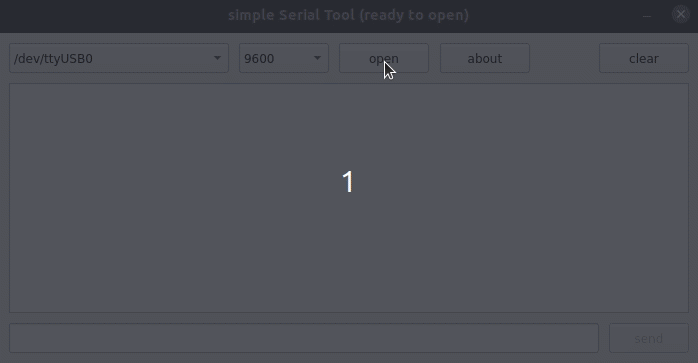

# simpleSerialTool

### install

```
sudo apt-get install build-essential qtcreator qt5-default qttools5-dev-tools qttools5-dev python3-dev python3 python3-pip python3-pyqt5
```

### clone and run

```
git clone https://github.com/geek2pm/simpleSerialTool.git
cd simpleSerialTool
pip3 install setuptools
pip3 install pyserial
sudo python3 app.py
```

### demo


